# 1. Product introduction

**keyestudio Sensor Kit for ARDUINO starters-K3**

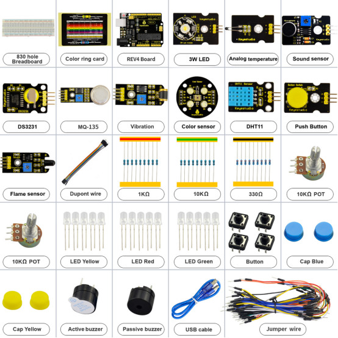

## 1. Introduction

This keyestudio Sensor Kit is an Arduino stater learning kit developed by Keyes. We provide detailed tutorials for each project or sensor module, including connection diagrams and sample codes, with which you will find it easy for you to complete every experiments. Besides, you can also find video tutorials of this kit on our official website.

## 1.2 Kit list

| No.  | Product Name                                 | Quantity | Picture                                |
| ---- | -------------------------------------------- | -------- | -------------------------------------- |
| 1    | Resistor 330Ω                                | 10       |                     |
| 2    | Resistor 1KΩ                                 | 10       |                     |
| 3    | Resistor 10KΩ                                | 10       |                     |
| 4    | LED Red                                      | 5        |  |
| 5    | LED Yellow                                   | 5        |  |
| 6    | LED Green                                    | 5        |  |
| 7    | Potentiometer 10KΩ                           | 2        |                     |
| 8    | Passive buzzer                               | 1        |                     |
| 9    | Active buzzer                                | 1        |                     |
| 10   | Button                                       | 1        |                     |
| 11   | Button cap Blue                              | 2        |                    |
| 12   | Button cap Yellow                            | 2        |                    |
| 13   | 830-hole Breadboard                          | 1        |                    |
| 14   | Jumper wire                                  | 1*65     |                    |
| 15   | M-F Dupont wire 20cm                         | 10       |                    |
| 16   | Resistor color code card                     | 1        |                    |
| 17   | KEYESTUDIO REV4                              | 1        |                    |
| 18   | USB cable 0.5m                               | 1        |                    |
| 19   | 3W LED Module                                | 1        | 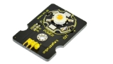    |
| 20   | Push Button module                           | 1        | 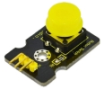    |
| 21   | Analog temperature sensor Module             | 1        | 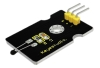    |
| 22   | DHT11 Temperature and Humidity Sensor module | 1        | 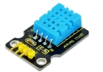   |
| 23   | Sound sensor module                          | 1        | 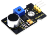                    |
| 24   | Flame sensor module                          | 1        | 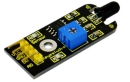   |
| 25   | Vibration sensor module                      | 1        | 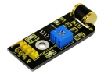   |
| 26   | DS3231 Clock Module                          | 1        | 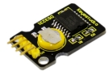  |
| 27   | MQ135 Air Quality Sensor module              | 1        | 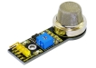  |
| 28   | Color sensor module                          | 1        | 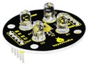                   |
| 29   | Component box                                | 1        |                    |

## 1.3 The Keyestudio REV4 (Black) Main Control Board

The Keyestudio REV4 (Black) Main Control Board is the best board to get started with electronics and coding. If this is your first experience tinkering with the platform, the Keyestudio REV4 (Black) Main Control Board is the most robust board you can start playing with.

Here is an explanation of what every element and interface of the board does:

| No.                  | Explain                                                      |
| -------------------- | ------------------------------------------------------------ |
|  | **ICSP（In-Circuit Serial Programming) Header** In most case, ICSP is the AVR, an Arduino micro-program header consisting of MOSI, MISO, SCK, RESET, VCC, and GND. It is often called the SPI (serial peripheral interface) and can be considered an "extension" of the output. In fact, slave the output devices under the SPI bus host. When connecting to PC, program the firmware to ATMEGA328P-PU. |
|  | **Power LED Indicator** Powering the Arduino, LED on means that your circuit board is correctly powered on. If LED is off, connection is wrong. |
| 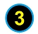 | **Digital I/O** Keyestudio REV4 (Black) Main Control Board has 14 digital input/output pins (of which 6 can be used as PWM outputs). These pins can be configured as digital input pin to read the logic value (0 or 1). Or used as digital output pin to drive different modules like LED, relay, etc. The pin labeled “〜” can be used to generate PWM. |
|  | **GND(Ground pin headers)** Used for circuit ground       |
|  | **AREF** Reference voltage (0-5V) for analog inputs. Used with analogReference() |
|  | **SDA** IIC communication pin                             |
|  | **SCL** IIC communication pin                             |
|  | **ICSP(In-Circuit Serial Programming) Header** In most case, ICSP is the AVR, an Arduino micro-program header consisting of MOSI, MISO, SCK, RESET, VCC, and GND. Connected to ATMEGA 16U2-MU. When connecting to PC, program the firmware to ATMEGA 16U2-MU. |
|  | **RESET Button** You can reset your Keyestudio REV4 (Black) Main Control Board, for example, start the program from the initial status. You can use the RESET button. |
|  | **D13 LED** There is a built-in LED driven by digital pin 13. When the pin is HIGH value, the LED is on, when the pin is LOW, it's off. |
|  | **USB Connection** Keyestudio REV4 (Black) Main Control Board can be powered via USB connector. All you needed to do is connecting the USB port to PC using a USB cable. |
|  | **ATMEGA 16U2-MU** USB to serial chip, can convert the USB signal into serial port signal. |
| 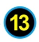 | **TX LED** Onboard you can find the label: TX (transmit).When Keyestudio REV4 (Black) Main Control Board communicates via serial port, send the message, TX led flashes. |
|  | **RX LED** Onboard you can find the label: RX(receive ).When Keyestudio REV4 (Black) Main Control Board communicates via serial port, receive the message, RX led flashes. |
|  | **Crystal Oscillator** How does Arduino calculate time? by using a crystal oscillator.The number printed on the top of the Arduino crystal is 16.000H9H. It tells us that the frequency is 16,000,000 Hertz or 16MHz. |
|  | **Voltage Regulator** Convert an external input DC7-12V voltage into DC 5V, then switch DC 5V  to the processor and other components. Output DC 5V, the drive current is 2A |
|  | **DC Power Jack** Keyestudio REV4 (Black) Main Control Board can be supplied with an external power DC7-12V from the DC power jack. |
|  | **IOREF** Used to configure the operating voltage of microcontrollers. Use it less. |
|  | **RESET Header** Connect an external button to reset the board. The function is the same as reset button (labeled 9) |
|  | **Power Pin 3V3** A 3.3 volt supply generated by the on-board regulator. Maximum current draw is 50 mA. |
|  | **Power Pin 5V** Provides 5V output voltage               |
|  | **Vin** You can supply an external power input DC7-12V through this pin to Keyestudio REV4 (Black) Main Control Board. |
|  | **Analog Pins** Keyestudio REV4 (Black) Main Control Board has 6 analog inputs, labeled A0 through A5. These pins can read the signal from analog sensors (such as humidity sensor or temperature sensor), and convert it into the digital value that can read by microcontrollers).Can also used as digital pins, A0=D14, A1=D15, A2=D16, A3=D17, A4=D18, A5=D19. |
|  | **Microcontroller** Each Keyestudio REV4 (Black) Main Control Board has its own microcontroller. You can regard it as the brain of your board. The main IC (integrated circuit) on the Arduino is slightly different from the panel pair. Microcontrollers are usually from ATMEL. Before you load a new program on the Arduino IDE, you must know what IC is on your board. This information can be checked at the top of IC. |

