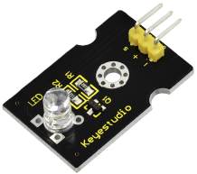
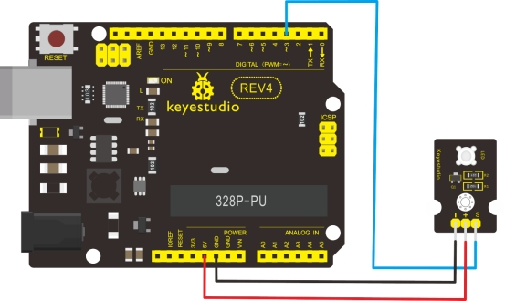

### Project 10 White LED Module



**1.Introduction** 

This LED light module has a shiny color, ideal for Arduino starters. It can be easily connected to IO/Sensor shield.

**2.Specification** 

- Type: Digital

- PH2.54 socket
- White LED module
- Enables interaction with light-related works
- Size: 30*20mm
- Weight: 3g

**3.Connection Diagram**



**4.Sample Code**

```c
int led = 3;

void setup()
{
  pinMode(led, OUTPUT);     //Set Pin3 as output
}

void loop()
{
  digitalWrite(led, HIGH);   //Turn on led
  delay(2000);
  digitalWrite(led, LOW);    //Turn off led
  delay(2000);
}
```

