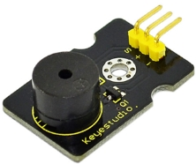
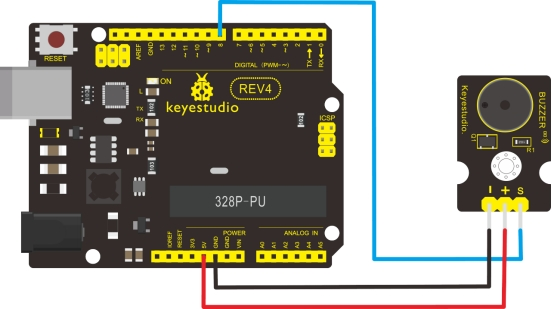

### Project 11 Passive Buzzer module



**1.Introduction** 

We can use Arduino to make many interactive works of which the most commonly used is acoustic-optic display. All the previous experiment has something to do with LED. However, the circuit in this experiment can produce sound. Normally, the experiment is done with a buzzer or a speaker while buzzer is simpler and easier to use. The buzzer we introduced here is a passive buzzer. It cannot be actuated by itself, but by external pulse frequencies. Different frequencies produce different sounds. We can use Arduino to code the melody of a song, which is actually quite fun and simple.

**2.Specification** 

- Working voltage: 3.3-5v
- Interface type: digital
- Size: 30*20mm
- Weight: 4g

**3.Connection Diagram**



**4.Sample Code**

```c
int buzzer=8;//set digital IO pin of the buzzer

void setup() 
{ 
	pinMode(buzzer,OUTPUT);// set digital IO pin pattern, OUTPUT to be output 
} 

void loop() 
{ 
    unsigned char i,j;//define variable
    while(1) 
    { 
        for(i=0;i<80;i++)// output a frequency sound
        { 
            digitalWrite(buzzer,HIGH);// sound
            delay(1);//delay1ms 
            digitalWrite(buzzer,LOW);//not sound
            delay(1);//ms delay 
        } 
        for(i=0;i<100;i++)// output a frequency sound
        { 
            digitalWrite(buzzer,HIGH);// sound
            digitalWrite(buzzer,LOW);//not sound
            delay(2);//2ms delay 
        }
    } 
} 
```

After downloading the program, buzzer experiment is finished.