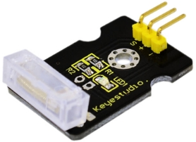
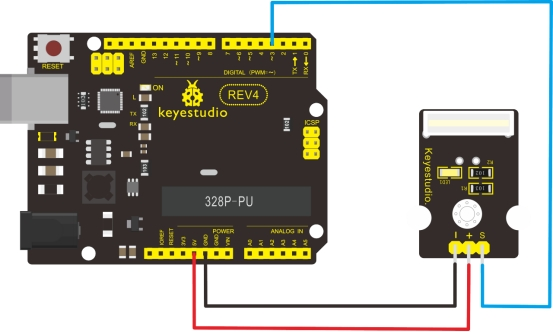

### Project 12: Knock Sensor Module



**1.Introduction** 

This module is a knock sensor. When you knock it, it can send a momentary signal. We can combine it with Arduino to make some interesting experiment, e.g. electronic drum

**2.Specification** 

- Working voltage: 5V
- Size: 30*20mm
- Weight: 3g

**3.Connection Diagram**



**4.Sample Code**

```c
int Led=13;//define LED interface
int Shock=3//define knock sensor interface;
int val;//define digital variable val

void setup()
{
    pinMode(Led,OUTPUT);//define LED to be output interface
    pinMode(Shock,INPUT);//define knock sensor to be output interface
}
void loop()
{
    val=digitalRead(Shock);//read the value of interface3 and evaluate it to val
    if(val==HIGH)//when the knock sensor detect a signal, LED will be flashing
    {
    	digitalWrite(Led,LOW);
    }
    else
    {
    	digitalWrite(Led,HIGH);
    }
}
```

