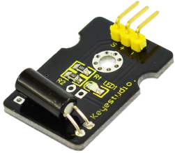
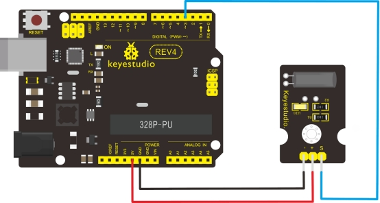

### Project 13 Digital Tilt Sensor



**1.Introduction** 

Tilt Sensor is a digital tilt switch. It can be used as a simple tilt sensor. Simply plug it to our IO/Sensor shield; you can make amazing interactive projects. With dedicated sensor shield and Arduino, you can achieve interesting and interactive work.

**2.Specification** 

- Supply Voltage: 3.3V to 5V
- Interface: Digital
- Size: 30*20mm
- Weight: 3g

**3.Connection Diagram**



**4.Sample Code**

```c
int ledPin = 13;                // Connect LED to pin 13
int switcher = 3;                 // Connect Tilt sensor to Pin3
 
void setup()
{
  pinMode(ledPin, OUTPUT);      // Set digital pin 13 to output mode
  pinMode(switcher, INPUT);       // Set digital pin 3 to input mode
}

void loop()
{
     
   if(digitalRead(switcher)==HIGH) //Read sensor value
   { 
        digitalWrite(ledPin, HIGH);   // Turn on LED when the sensor is tilted
   }
   else
   {
        digitalWrite(ledPin, LOW);    // Turn off LED when the sensor is not triggered
   }
}
```

