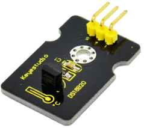
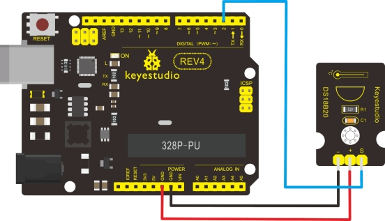

### Project 14: 18B20 Temperature Sensor



**1.Introduction** 

DS18B20 is a digital temperature sensor. It can be used to quantify environmental temperature testing. The temperature range is -55 ~ +125 ℃, inherent temperature resolution 0.5 ℃. It also support multi-point mesh networking. Three DS18B20 can be deployed on three lines to achieve multi-point temperature measurement. It has a 9-12 bit serial output. 

**2.Specification** 

- Supply Voltage: 3.3V to 5V
- Temperature range: -55 °C ~ +125 °C
- Interface: Digital
- Size: 30*20mm
- Weight: 3g

**3.Connection Diagram**



**4.Sample Code**

```c
#include <OneWire.h>
int DS18S20_Pin = 2; //DS18S20 Signal pin on digital pin 2
 //Temperature chip i/o
OneWire ds(DS18S20_Pin);  // on digital pin 2

void setup(void) 
{
  Serial.begin(9600);
}

void loop(void) 
{
  float temperature = getTemp();
  Serial.println(temperature);
  delay(100); //to slow down the output so it is easier to read
}
 
float getTemp()
{
  //returns the temperature from one DS18S20 in DEG Celsius
 
  byte data[12];
  byte addr[8];

  if ( !ds.search(addr)) 
  {
      //no more sensors on chain, reset search
      ds.reset_search();
      return -1000;
  }
 
  if ( OneWire::crc8( addr, 7) != addr[7])
  {
      Serial.println("CRC is not valid!");
      return -1000;
  }
  if ( addr[0] != 0x10 && addr[0] != 0x28) 
  {
      Serial.print("Device is not recognized");
      return -1000;
  }
 
  ds.reset();
  ds.select(addr);
  ds.write(0x44,1); // start conversion, with parasite power on at the end
 
  byte present = ds.reset();
  ds.select(addr);    
  ds.write(0xBE); // Read Scratchpad
   
  for (int i = 0; i < 9; i++) // we need 9 bytes
  { 
    data[i] = ds.read();
  }
  ds.reset_search();
  byte MSB = data[1];
  byte LSB = data[0];
  float tempRead = ((MSB << 8) | LSB); //using two's compliment
  float TemperatureSum = tempRead / 16;
  return TemperatureSum;
}
```

