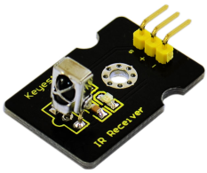
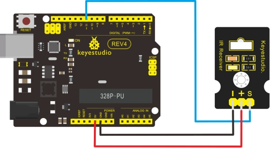

### Project 15 Digital IR Receiver Module



**1.Introduction** 

IR is widely used in remote control. With this IR receiver, Arduino project is able to receive command from any IR remoter controller if you have the right decoder. Well, it will be also easy to make your own IR controller using IR transmitter.

**2.Specification** 

- Power Supply: 5V
- Interface: Digital
- Modulate Frequency: 38Khz
- Module interface socket: JST PH2.0
- Size: 30*20mm
- Weight: 4g

**3.Wiring Diagram** 

The following image shows a suggested connection method. You may use any Digital I/O pin that is not in use by another device. 

NOTE: In the sample code below Digital pin 11 is in use, you may either change your wiring or change the sample code to match.

**4.Connection diagram**



**5.Sample Code**

```c
#include <IRremote.h>
int RECV_PIN = 11;
IRrecv irrecv(RECV_PIN);
decode_results results;

void setup()
{
  Serial.begin(9600);
  irrecv.enableIRIn(); // Start the receiver
}

void loop() 
{
  if (irrecv.decode(&results)) 
  {
    Serial.println(results.value, HEX);
    irrecv.resume(); // Receive the next value
  }
}
```

