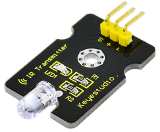
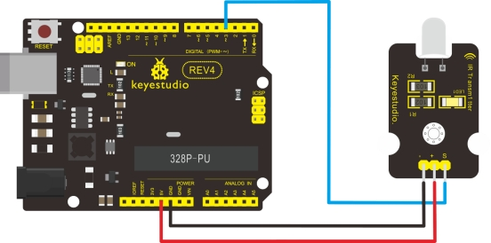

### Project 16 Digital IR Transmitter Module



**1.Introduction**

 IR Transmitter Module is designed for IR communication which is widely used for operating the television device from a short line-of-sight distance. The remote control is usually contracted to remote.

Since infrared (IR) remote controls use light, they require line of sight to operate the destination device. The signal can, however, be reflected by mirrors, just like any other light source.

If operation is required where no line of sight is possible, for instance when controlling equipment in another room or installed in a cabinet, many brands of IR extenders are available for this on the market. Most of these have an IR receiver, picking up the IR signal and relaying it via radio waves to the remote part, which has an IR transmitter mimicking the original IR control.

Infrared receivers also tend to have a more or less limited operating angle, which mainly depends on the optical characteristics of the phototransistor. However, it’s easy to increase the operating angle using a matte transparent object in front of the receiver.

**2.Specification** 

- Power Supply: 3-5V
- Infrared center frequency: 850nm-940nm
- Infrared emission angle: about 20degree
- Infrared emission distance: about 1.3m (5V 38Khz)
- Interface socket: JST PH2.0
- Mounting hole: inner diameter is 3.2mm, spacing is 15mm
- Size: 35*20mm
- Weight: 3g

**3.Connection Diagram**



**4.Sample code**

```c
int led = 3;

void setup() 
{                
   pinMode(led, OUTPUT);     
}

void loop() 
{
  digitalWrite(led, HIGH);  
  delay(1000);               
  digitalWrite(led, LOW);   
  delay(1000); 
}
```

In the darkness of the environment, you are going to see blinking blue light on phone's screen when using camera to shoot the infrared LED.

Infrared remote/communication:

- Hardware List
- UNO R3 x2
- Digital IR Receiver x1

- IR Transmitter Module x1

**5.Connection Diagram** 

IR Transmitter: same as above, Notice: Arduino-IRremote only supports D3 as transmitter.


IR Receiver:  connect it to D11 port.


Upload code to the UNO connected with IR Transmitter:

```c
#include <IRremote.h>
IRsend irsend;

void setup()
{
}

void loop() 
{
  irsend.sendRC5(0x0, 8); //send 0x0 code (8 bits)
     delay(200);
  irsend.sendRC5(0x1, 8); 
     delay(200); 
}
```

Upload code to the UNO connected with IR Receiver:

```c
#include <IRremote.h>
const int RECV_PIN = 11;
const int LED_PIN = 13;
IRrecv irrecv(RECV_PIN);
decode_results results;
 
void setup()
{
   Serial.begin(9600);
   irrecv.enableIRIn(); // Start the receiver
}

void loop() 
{
   if (irrecv.decode(&results)) 
   { 
   	   if ( results.bits > 0 )
       {
           int state;
           if ( 0x1 == results.value )	
           {		
             state = HIGH;
           }
           else
           {
            state = LOW;
           }
           digitalWrite( LED_PIN, state );			
       }
       irrecv.resume();        // prepare to receive the next value
   }
} 
```

**6.Result**

The "L" LED of the shield connected with IR Receiver will blink when IR Receiver faces to IR Transmitter.