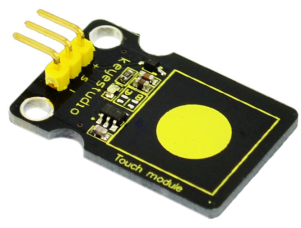
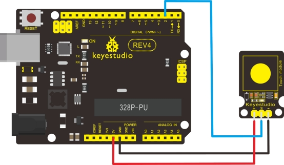

### Project 17 Capacitive Touch Sensor



**1.Introduction** 

Are you tired of clicking mechanic button? Well, try our capacitive touch sensor. We can find touch sensors mostly on electronic device. So upgrade your Arduino project with our new version touch sensor and make it cool!!

This little sensor can "feel" people and metal touch and feedback a high/low voltage level. Even isolated by some cloth and paper, it can still feel the touch. Its sensetivity decrease as isolation layer gets thicker. For detail of usage, please check our wiki. To perfect user’s experience of our sensor module, we made following improvements.

**2.Specification** 

- Supply Voltage: 3.3V to 5V
- Interface: Digital
- Size: 30*20mm
- Weight: 3g

**3.Connection Diagram**



**4.Sample Code**

```c
int ledPin = 13;                // Connect LED on pin 13, or use the onboard one
int KEY = 2;                 // Connect Touch sensor on Digital Pin 2
 
void setup()
{
  pinMode(ledPin, OUTPUT);      // Set ledPin to output mode
  pinMode(KEY, INPUT);       //Set touch sensor pin to input mode
}
 
void loop()
{
   if(digitalRead(KEY)==HIGH) //Read Touch sensor signal
   {      
        digitalWrite(ledPin, HIGH);   // if Touch sensor is HIGH, then turn on
   }
   else
   {
        digitalWrite(ledPin, LOW);    // if Touch sensor is LOW, then turn off the led
   }
}
```

