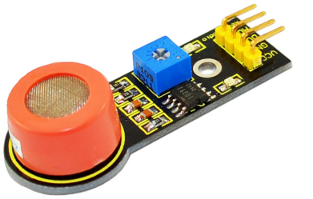
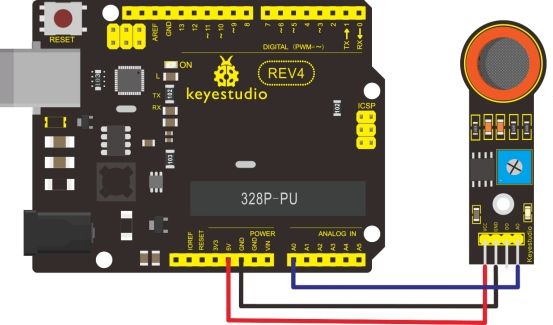

### Project 18 Analog Alcohol Sensor



**1.Introduction** 

This analog gas sensor - MQ3 is suitable for detecting alcohol. It can be used in a Breath analyzer. It has good selectivity because it has higher sensitivity to alcohol and lower sensitivity to Benzine. The sensitivity can be adjusted by A potentiometer.

**2.Specification** 

- Power supply: 5V
- Interface type: Analog
- Quick response and High sensitivity
- Simple drive circuit
- Stable and long service life
- Size: 49.7*20mm
- Weight: 6g

**3.Connection Diagram**



**4.Sample Code**

```c
void setup()
{
   Serial.begin(9600); //Set serial baud rate to 9600 bps
}

void loop()
{
    int val;
    val=analogRead(0);//Read Gas value from analog 0
    Serial.println(val,DEC);//Print the value to serial port
    delay(100);
}
```

