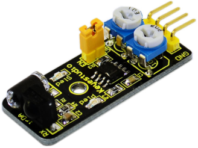
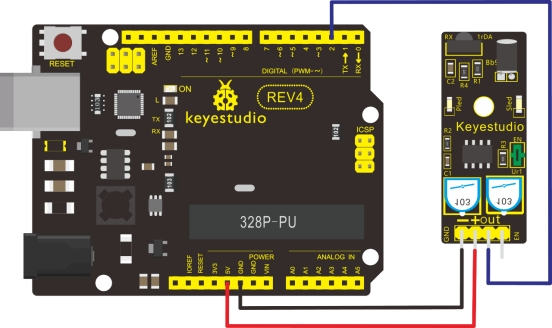

### Project 19 Infrared Obstacle Avoidance Sensor



**1.Introduction** 

Infrared obstacle avoidance sensor is equipped with distance adjustment function and is especially designed for wheeled robots. This sensor has strong adaptability to ambient light and is of high precision. It has a pair of infrared transmitting and receiving tube. When infrared ray launched by the transmitting tube encounters an obstacle (its reflector), the infrared ray is reflected to the receiving tube, and the indicator will light up; the signal output interface outputs digital signal. We can adjust the detection distance through the potentiometer knob ( effective distance: 2～40cm, working Voltage: 3.3V-5V ). Thanks to a wide voltage range, this sensor can work steadily even under fluctuating power supply voltage and is suitable for the use of various micro-controllers, Arduino controllers and BS2 controllers. A robot mounted with the sensor can sense changes in the environment.

**2.Specification** 

- Working voltage: DC 3.3V-5V
- Working current: ≥20mA
- Working temperature: －10℃—＋50℃
- Detection distance: 2-40cm
- IO Interface: 4 wire interface (-/+/S/EN)
- Output signal: TTL voltage
- Accommodation mode: Multi-circle resistance regulation
- Effective Angle: 35°
- Size: 41.7*16.7mm
- Weight: 5g

**3.Connection Diagram**



**4.Sample Code**

```c
const int sensorPin = 2;     // the number of the sensor pin
const int ledPin =  13;      // the number of the LED pin
int sensorState = 0;         // variable for reading the sensor status

void setup() 
{
  pinMode(ledPin, OUTPUT);      
  pinMode(sensorPin, INPUT); 
}

void loop()
{
  // read the state of the sensor value:
  sensorState = digitalRead(sensorPin);
  // if it is, the sensorState is HIGH:
  if (sensorState == HIGH) 
  {     
     digitalWrite(ledPin, HIGH);  
  } 
  else 
  {
       digitalWrite(ledPin, LOW); 
  }
}
```

