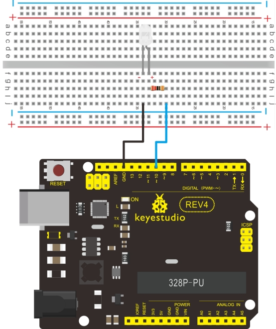

### Project 2 LED blinking


**1.Introduction** 

Blinking LED experiment is quite simple. In the "Hello World!" program, we have come across LED. This time, we are going to connect an LED to one of the digital pins rather than using LED13, which is soldered to the board. Except an Arduino and an USB cable, we will need extra parts as below:

**2.Hardware required**

- Red M5 LED*1
- 330Ω resistor*1
- Breadboard*1
- Breadboard jumper wires

**3.Circuit connection**

We follow below diagram from the experimental schematic link. Here we use digital pin 10. We connect LED to a 220 ohm resistor to avoid high current damaging the LED.



**4.Sample program**

```c
int ledPin = 10; // define digital pin 10.

void setup()
{
	pinMode(ledPin, OUTPUT);// define pin with LED connected as output.
}

void loop()
{
    digitalWrite(ledPin, HIGH); // set the LED on.
    delay(1000); // wait for a second.
    digitalWrite(ledPin, LOW); // set the LED off.
    delay(1000); // wait for a second
}
```

**5.Result**

After downloading this program, in the experiment, you will see the LED connected to pin 10 turning on and off, with an interval approximately one second. The LED blinking experiment is now complete. Thank you!