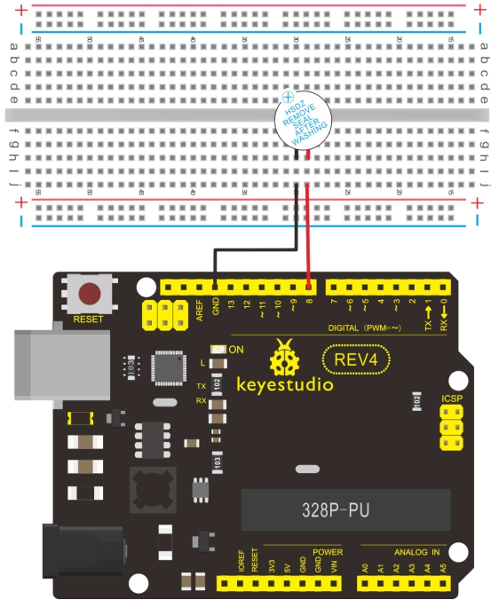

### Project 8 Active buzzer


**1.Introduction** 

Arduino enables us to make many interesting interactive projects, many of which we have done consists of a LED. They are light-related. While this time, the circuit will produce sound. The sound experiment is usually done with a buzzer or a speaker, while buzzer is simpler and easier to use. The buzzer we introduced here is a passive buzzer. It cannot be actuated by itself, but by external pulse frequencies. Different frequencies produce different sounds. We can use Arduino to code the melody of a song, which is actually fun and simple.

**2.Hardware required** 

- Buzzer*1
- Breadboard*1
- Breadboard jumper wires

**3.Circuit connection**



When connecting the circuit, pay attention to the positive & the negative poles of the buzzer. In the photo, you can see there are red and black lines. When the circuit is finished, you can begin programming.

**4.Sample program** 

Program is simple. You control the buzzer by outputting high/low level. 

```c
int buzzer=8;// initialize digital IO pin that controls the buzzer

void setup() 
{ 
   pinMode(buzzer,OUTPUT);// set pin mode as “output”
}

void loop() 
{
	digitalWrite(buzzer, HIGH); // produce sound
}
```

**5.Result** 

After downloading the program, the buzzer experiment is completed. You can see the buzzer is ringing.